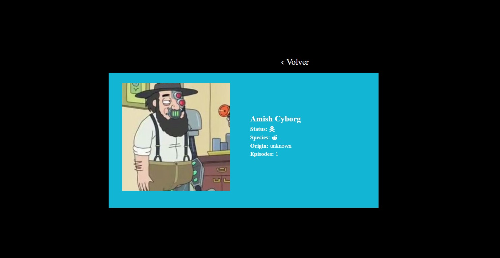

# Welcome to Rick and Morty Land, Lad!

Welcome to the **Rick and Morty Land website**, the only dimension where you will be able to travel all around Rick and Morty's universe characters with just one click.

Mocked up and developped with **HTML, Sass and React JS** Rick and Morty Land will allow you to search whoever you want whenever you want just by clicking on the Github Pages link attached above in the description.

## Find your favorite characters

Thanks to the filters above Rick and Morty Land allows you to look for your favorite characters following this criteria:

- **Name**: no matter if you write it in lowercase or uppercase your search will always be a success. However, if you look for a non existing character, you will get an error message back to warn you.

- **Species**: choosing between the two existing species: humans or aliens.

- **Status**: select the status of your characters among all the options on the list.

- **Origin**: check as many origins as you want to find all the characters you wish.

If you change your mind and you want to use no filter, just by clicking on the reset button attached below you will be able to reset all the filter values to their starting point.

Furthermore, if you wish to keep your search for the future, do not worry. The page is developed to store all filters information in your Local Storage so you can go back to your former search whenever you want.

## Check your favorite characters details

Once you have found all your favorite characters you will be able to access their character details just by clicking on their cards getting to know them better.

Moreover, if you want to share their information with your colleagues just by copying the url above you will be able to share your favorite character details with everybody.

Nevertheless, be careful. If you change the url looking for a non existing character you will get another error message back warning you.

Go back to the main page just by clicking on the "Volver" button above.

## Thanks for visiting my universe!

Thank you for coming to visit my Github repository. I hope you really enjoyed this Rick and Morty universe quick visit and I will be more than glad to see you around.

And remember **Wubba Lubba Dub Dub!!**
